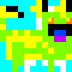

# QuiltroDnaParser

Este utilitario convierte una imagen gif en base a una [paleta de colores](palette.md) a formato un tipo PPM (texto plano) compatible con CryptoQuiltros.


*Nota: La imagen es rotada en 90 grados para mantener la orientación original en la imagen de salida final.

### preview()

## Ejemplo
```bash
python preview.py sources/images/quiltro-1.gif
```

```bash
777771111122222444447777722222222222222222222111113333333333
777771111122222444447777722222222222222222222111113333333333
777771111122222444447777722222222222222222222111113333333333
777771111122222444447777722222222222222222222111113333333333
777771111122222444447777722222222222222222222111113333333333
111110000022222222224444466666555552222222222222220000000000
111110000022222222224444466666555552222222222222220000000000
111110000022222222224444466666555552222222222222220000000000
111110000022222222224444466666555552222222222222220000000000
111110000022222222224444466666555552222222222222220000000000
333330000022222222227777766666555552222222222222220000033333
333330000022222222227777766666555552222222222222220000033333
333330000022222222227777766666555552222222222222220000033333
333330000022222222227777766666555552222222222222220000033333
333330000022222222227777766666555552222222222222220000033333
333330000022222444447777777777222222222222222222222222222222
333330000022222444447777777777222222222222222222222222222222
333330000022222444447777777777222222222222222222222222222222
333330000022222444447777777777222222222222222222222222222222
333330000022222444447777777777222222222222222222222222222222
777777777722222222222222222222222222222222222222220000033333
777777777722222222222222222222222222222222222222220000033333
777777777722222222222222222222222222222222222222220000033333
777777777722222222222222222222222222222222222222220000033333
777777777722222222222222222222222222222222222222220000033333
111111111111111000000000022222222222222222222111113333333333
111111111111111000000000022222222222222222222111113333333333
111111111111111000000000022222222222222222222111113333333333
111111111111111000000000022222222222222222222111113333333333
111111111111111000000000022222222222222222222111113333333333
333331111133333333333333322222222222222222222111110000033333
333331111133333333333333322222222222222222222111110000033333
333331111133333333333333322222222222222222222111110000033333
333331111133333333333333322222222222222222222111110000033333
333331111133333333333333322222222222222222222111110000033333
333333333333333333333333322222222222222222222111110000000000
333333333333333333333333322222222222222222222111110000000000
333333333333333333333333322222222222222222222111110000000000
333333333333333333333333322222222222222222222111110000000000
333333333333333333333333322222222222222222222111110000000000
333333333377777333333333322222222222222222222222222222233333
333333333377777333333333322222222222222222222222222222233333
333333333377777333333333322222222222222222222222222222233333
333333333377777333333333322222222222222222222222222222233333
333333333377777333333333322222222222222222222222222222233333
333337777711111333333333300000222222222222222222222222222222
333337777711111333333333300000222222222222222222222222222222
333337777711111333333333300000222222222222222222222222222222
333337777711111333333333300000222222222222222222222222222222
333337777711111333333333300000222222222222222222222222222222
333337777711111333333333322222000000000000000000003333333333
333337777711111333333333322222000000000000000000003333333333
333337777711111333333333322222000000000000000000003333333333
333337777711111333333333322222000000000000000000003333333333
333337777711111333333333322222000000000000000000003333333333
333331111111111222222222222222222223333333333333333333333333
333331111111111222222222222222222223333333333333333333333333
333331111111111222222222222222222223333333333333333333333333
333331111111111222222222222222222223333333333333333333333333
333331111111111222222222222222222223333333333333333333333333

```

### output_ppm()

```bash
777771111122222444447777722222222222222222222111113333333333.777771111122222444447777722222222222222222222111113333333333.777771111122222444447777722222222222222222222111113333333333.777771111122222444447777722222222222222222222111113333333333.777771111122222444447777722222222222222222222111113333333333.111110000022222222224444466666555552222222222222220000000000.111110000022222222224444466666555552222222222222220000000000.111110000022222222224444466666555552222222222222220000000000.111110000022222222224444466666555552222222222222220000000000.111110000022222222224444466666555552222222222222220000000000.333330000022222222227777766666555552222222222222220000033333.333330000022222222227777766666555552222222222222220000033333.333330000022222222227777766666555552222222222222220000033333.333330000022222222227777766666555552222222222222220000033333.333330000022222222227777766666555552222222222222220000033333.333330000022222444447777777777222222222222222222222222222222.333330000022222444447777777777222222222222222222222222222222.333330000022222444447777777777222222222222222222222222222222.333330000022222444447777777777222222222222222222222222222222.333330000022222444447777777777222222222222222222222222222222.777777777722222222222222222222222222222222222222220000033333.777777777722222222222222222222222222222222222222220000033333.777777777722222222222222222222222222222222222222220000033333.777777777722222222222222222222222222222222222222220000033333.777777777722222222222222222222222222222222222222220000033333.111111111111111000000000022222222222222222222111113333333333.111111111111111000000000022222222222222222222111113333333333.111111111111111000000000022222222222222222222111113333333333.111111111111111000000000022222222222222222222111113333333333.111111111111111000000000022222222222222222222111113333333333.333331111133333333333333322222222222222222222111110000033333.333331111133333333333333322222222222222222222111110000033333.333331111133333333333333322222222222222222222111110000033333.333331111133333333333333322222222222222222222111110000033333.333331111133333333333333322222222222222222222111110000033333.333333333333333333333333322222222222222222222111110000000000.333333333333333333333333322222222222222222222111110000000000.333333333333333333333333322222222222222222222111110000000000.333333333333333333333333322222222222222222222111110000000000.333333333333333333333333322222222222222222222111110000000000.333333333377777333333333322222222222222222222222222222233333.333333333377777333333333322222222222222222222222222222233333.333333333377777333333333322222222222222222222222222222233333.333333333377777333333333322222222222222222222222222222233333.333333333377777333333333322222222222222222222222222222233333.333337777711111333333333300000222222222222222222222222222222.333337777711111333333333300000222222222222222222222222222222.333337777711111333333333300000222222222222222222222222222222.333337777711111333333333300000222222222222222222222222222222.333337777711111333333333300000222222222222222222222222222222.333337777711111333333333322222000000000000000000003333333333.333337777711111333333333322222000000000000000000003333333333.333337777711111333333333322222000000000000000000003333333333.333337777711111333333333322222000000000000000000003333333333.333337777711111333333333322222000000000000000000003333333333.333331111111111222222222222222222223333333333333333333333333.333331111111111222222222222222222223333333333333333333333333.333331111111111222222222222222222223333333333333333333333333.333331111111111222222222222222222223333333333333333333333333.333331111111111222222222222222222223333333333333333333333333
```

### image_from_ppm()


Notese que el mapa de colores soportado está restringido a estos valores, las imágenes gif usadas fueran creadas con [Gimp](https://www.gimp.org/). 


```python
self.colour_map = {
    0: (255, 255, 255),
    1: (255, 255, 0),
    2: (0, 0, 0),
    3: (128, 255, 0),
    4: (0, 64, 255),
    5: (192, 0, 255),
    6: (255, 128, 0),
    7: (0, 255, 255),
    8: (255, 0, 255)
}
```

Es importante guardar la imagen en formato Gif en modo RGB para no tener problemas de compatibilidad con la [paleta de colores](palette.md).


## Client Side
